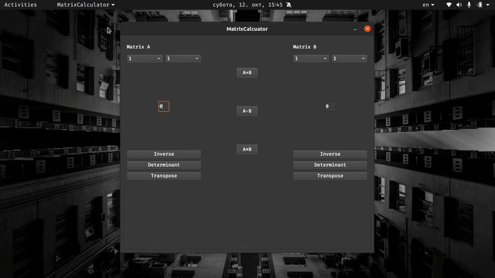

# Matrix Calculator
Here is a demonstration of the application in action:

A simple Matrix Calculator built using Qt and C++. This application allows users to perform various matrix operations, including addition, multiplication, inversion, determinant calculation, and transposition. The project utilizes the Eigen library for efficient matrix algebra.

## Features

- Input for two matrices
- Calculate the following operations:
  - Sum
  - Product
  - Inverse
  - Determinant
  - Transpose
- User-friendly graphical interface
- Demonstration GIF showcasing functionality
